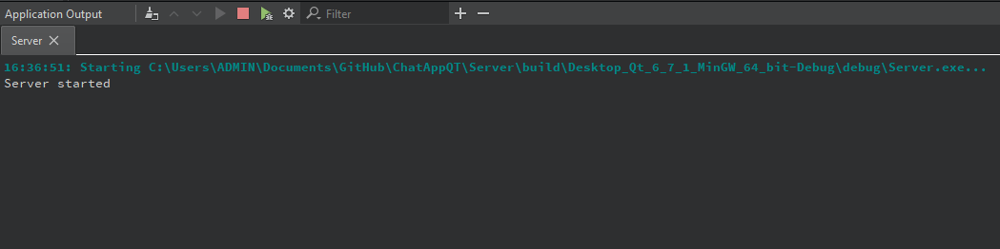
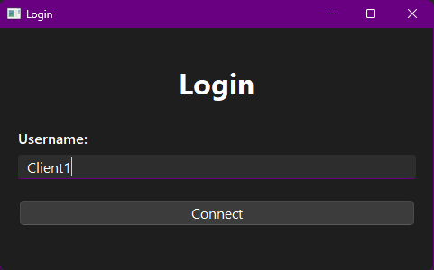
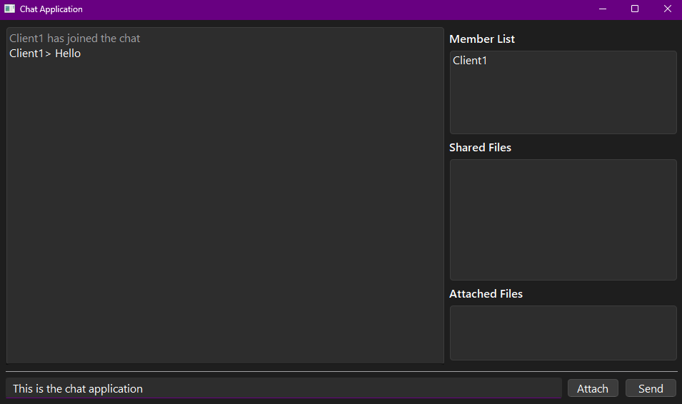
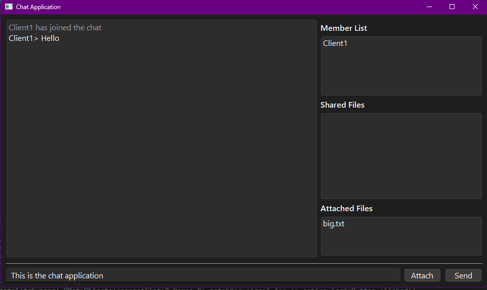
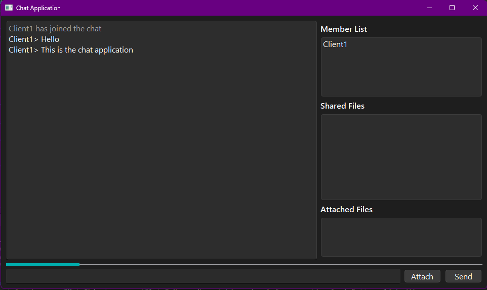
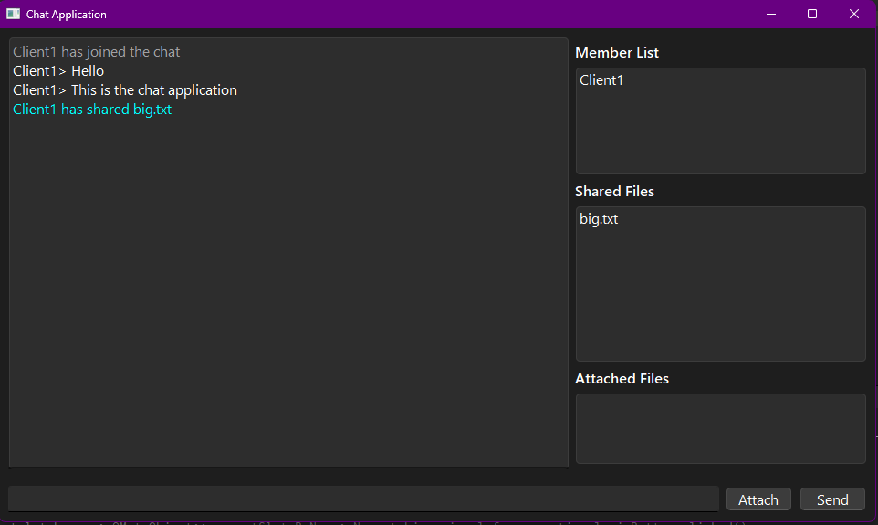

# Multi-threading Chatapp using QT Framework
This repository contains the code for the Multi-threading Chatapp using QT Framework. 
This app uses QTcpSocket for client - server connection and QThread for multi-threading.
The system can handle multiple clients at once and allow file sharing.

## Installation
To clone the repository, run the following command:
```bash
git clone https://github.com/nonameex1sts/ChatApp_QTFramework.git
```

Open `Client\Client.pro` and `Server\Server.pro` with QT Creator.

## Execute the server
Run the server project in QT Creator, if the server started succesfully, the console will output `Server started`.

<p align="center">
  
</p>

## Execute the client
Run the client project in QT Creator, if the client started succesfully, the Login window will appear.
Enter username (cannot be empty) and click `Connect` to login.

<p align="center">
  
</p>

**Note:** The server must be started successfully before client login.

In the chat window, type messages in the textbox bellow and click `Send`. 
The conversation will be displayed on the upper-left box while the list of clients will
be shown in the `Member List` box.

<p align="center">
  
</p>

Click `Attach` attach file from your local computer, the list of attached files will be shown 
above the `Attach` button. Double click a file in the `Attached Files` box to detach it.

<p align="center">
  
</p>

Click `Send` to send the attached files, a progress bar will be displayed above the textbox.

<p align="center">
  
</p>

After the files are successfully sent to the server, they will show up in the `Shared Files` box.
Double click a file in the `Shared Files` box to download it, the file will be automatically saved in
your local Download folder.

<p align="center">
  
</p>